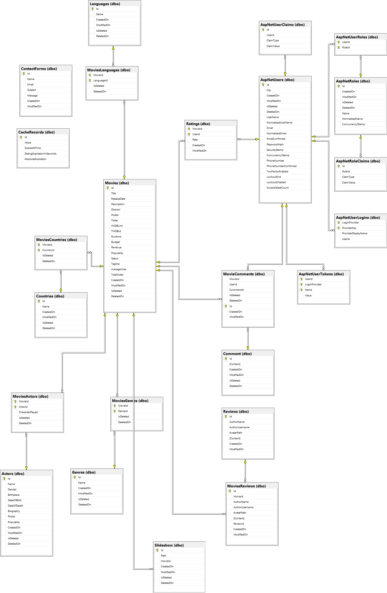

# Entertainment Hub

	
	

## 🔗 Link

* https://entertainment-hub.azurewebsites.net

## 🧰 Project Template

* [Niki Kostov's Template](https://github.com/NikolayIT/ASP.NET-Core-Template)

## 📃 Project Description

Entertainment Hub is an easy to use web application with an interactive, high quality interface that follows the best trends in the business.
On the homepage you will find a stylish navigation bar, where you can quickly go and see all the movies, actors, movies that have a certain genre or movies that were filmed in a given country. There is also a contact page where users can submit a question or a recommendation for the creator. You will also see a random movie on every homepage visit. It consists of four moving images, a trailer and a direct link to it. The user can also search for his favourite movies and actors. A little bellow that, when users click on login or register there is a nice separate view for all the user operations. Scrolling down, users can see three different sections that contain the most rated, most popular and recently added movies. Also there is a moving section of the latest movies. At the bottom, of course, it's the footer part where there are more movies, selected genres, movies by year of release and the social media contacts. When a user clicks on a movie he can see a lot of information about it, aswell as it's main actors, best reviews and a user can also rate and comment on it. There is also a secured area, where the Admin can answer  user submissions and delete them. He can also add new movies using the TMDB API. The Admin area will grow, so will the whole application. In the near future I plan to do the TV-Series part.

## 🔨 Built Using

* [ASP.NET Core 6.0](https://github.com/dotnet/aspnetcore)
* [ASP.NET Core WebAPI](https://learn.microsoft.com/en-us/aspnet/core/tutorials/first-web-api?view=aspnetcore-6.0&tabs=visual-studio)
* [Entity Framework Core 6.0](https://github.com/dotnet/efcore)
* [MSSQL Server](https://www.microsoft.com/en-us/sql-server/sql-server-2019)
* [Visual Studio 2022](https://github.com/github/VisualStudio)
* [SendGrid](https://github.com/sendgrid)
* [AutoMapper](https://github.com/AutoMapper/AutoMapper)
* [Newtonsoft.Json](https://github.com/JamesNK/Newtonsoft.Json)
* [Google ReCaptcha v3](https://developers.google.com/recaptcha)
* [Distributed Caching](https://learn.microsoft.com/en-us/aspnet/core/performance/caching/distributed?view=aspnetcore-6.0)
* [TMDB API](https://developers.themoviedb.org/3/getting-started/introduction)
* AJAX Requests
* Repository Pattern
* [xUnit](https://github.com/xunit/xunit)
* [Mock](https://github.com/moq/moq)
* [Integration testing](https://learn.microsoft.com/en-us/aspnet/core/test/integration-tests?view=aspnetcore-6.0)
* [SQLite(InMemory Db for testing)](https://www.sqlite.org/index.html)
---------
* [JQuery](https://github.com/jquery/jquery)
* [Star Rating](https://github.com/nashio/star-rating-svg)
* [QRCode.js](https://davidshimjs.github.io/qrcodejs/)
---------
* [Bootstrap](https://github.com/twbs/bootstrap)
* [SCSS](https://sharkcoder.com/tools/scss)
* [Font Awesome](https://fontawesome.com/icons)

## 🌐 Database Diagram

## 👦 Author

* LinkedIn - [Kiril Tolev](https://www.linkedin.com/in/kiril-tolev/)

## 📜 License

This project is licensed with the [MIT license](LICENSE)
